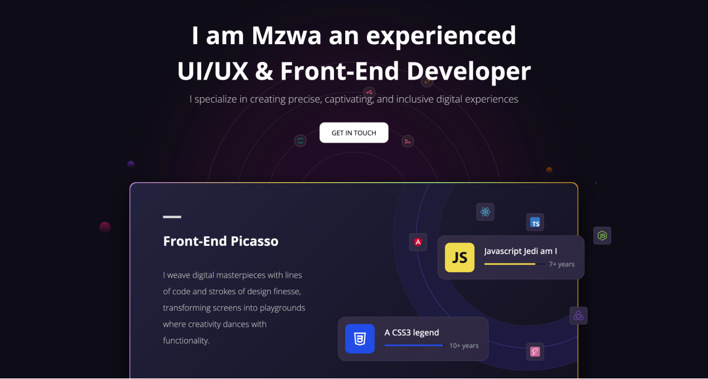

# Mzwwwa

🚀 My portfolio code, built with Angular 16 for the frontend, fetches data from an api I created with node and express. 
Like what you see? Feel free to get in touch.

## Table of contents

- [Overview](#overview)
  - [Screenshot](#screenshot)
  - [Links](#links)
- [Tech Stack](#tech-stack)
- [Author](#author)

## Overview

### Screenshot

### Links

- Code URL: [Github Repo.](https://github.com/mzwabantu/portfolio-ui)
- Live Site URL: [Eezy Bank](http://mzwwwa.co.za/)

## Tech stack

- Angular
- GSAP 
- Typescript
- Bootstrap 5

## Author

- Website - [Mzwabantu](https://mzwwwa.co.za/)
- LinkedIn - [mzwabantungubelanga](https://za.linkedin.com/in/mzwabantungubelanga)
- Dribbble - [MzwaN](https://dribbble.com/MzwaN)